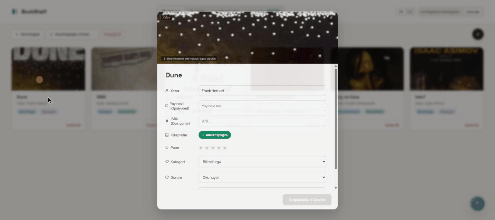
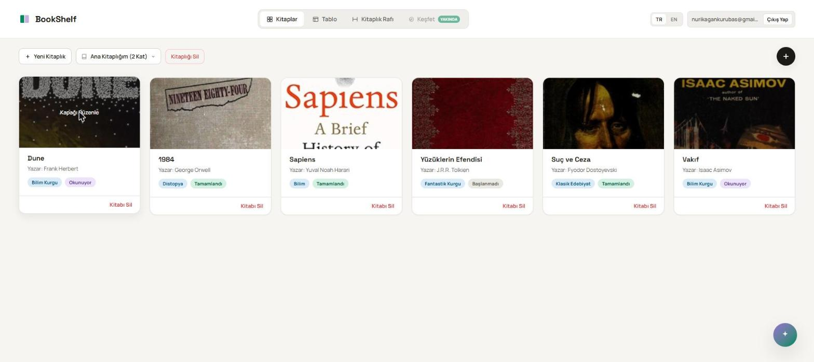
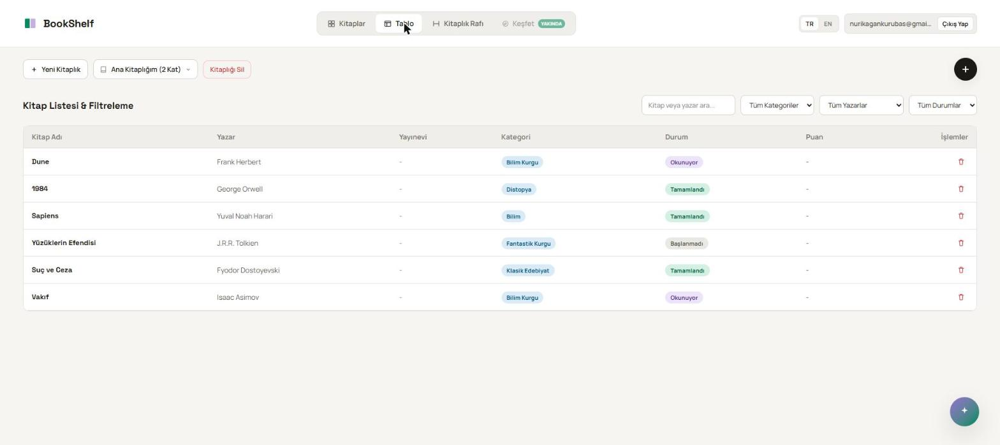
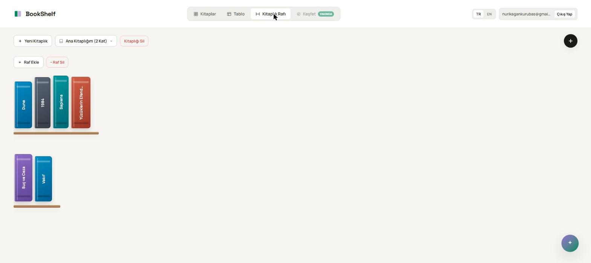
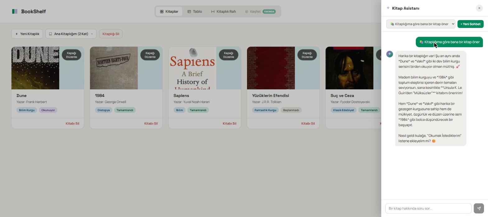

<p align="center">
  
</p>

<h1 align="center">BookShelf</h1>

<p align="center">
  <strong>Your bookshelf, wherever you go.</strong>
</p>

<p align="center">
  <a href="#english">
    
  </a>
  &nbsp;
  <a href="#türkçe">
    
  </a>
</p>

<p align="center">
  
  
  
  
  <a href="https://github.com/kagankurubas/bookshelf/actions/workflows/ci.yml">
    
  </a>
  
</p>

<p align="center">
  <a href="https://yourbookshelf-app.netlify.app">
    
  </a>
</p>

---

## English

A personal book-tracking app — log your books, filter by category,
status and rating, add them fast by scanning a barcode or searching by
title, and arrange them on a real-feeling bookshelf you can drag and
drop. Includes a Book Assistant that recommends books based on your
library and lets you chat about what you're reading.

### Demo

<p align="center">
  
</p>

### Features

- **Book management** — title, author, publisher, category, reading
  status, rating, page count, cover image, notes.
- **Three views** — cards, a filterable/searchable table, and a
  bookshelf.
- **Dynamic shelves** — no fixed slot/capacity; each shelf row grows to
  exactly however many books you put on it, and you can drag books
  between shelves and reorder them.
- **Multiple libraries** — organize books into separate libraries; the
  first one you create becomes a protected main library that always
  holds every book, so nothing gets orphaned if you delete another one.
- **Reading statistics dashboard** — total books/pages read and average
  rating, yearly and monthly reading trends, and a category breakdown,
  all filterable by year.
- **Fast add flows** — scan a barcode (single or batch), search by
  title (Open Library), or add manually.
- **Book Assistant** — an AI chat panel that gives personalized
  recommendations based on your library and remembers conversation
  history (Gemini API).
- **Multi-language** — Turkish / English.
- **Accounts** — email/password sign-in; every user's data (libraries,
  books, chats) is isolated via Supabase Row Level Security.
- **Account deletion** — permanently delete your account and every bit
  of your data (libraries, books, Book Assistant chat history) from
  Settings, behind a confirmation step (type to confirm, or re-enter
  your password).

### Screenshots

<table align="center">
  <tr>
    <td align="center">
      
      <br><strong>Cards</strong>
    </td>
    <td align="center">
      
      <br><strong>Table</strong>
    </td>
  </tr>
  <tr>
    <td align="center">
      
      <br><strong>Dynamic shelf</strong>
    </td>
    <td align="center">
      
      <br><strong>Book Assistant</strong>
    </td>
  </tr>
</table>

### Tech stack

- **Frontend**: React 19 + Vite, `react-i18next` (TR/EN)
- **Backend**: Supabase (Postgres + Auth + Row Level Security + Edge
  Functions)
- **AI**: Google Gemini API, called from a server-side Edge Function
  (the key never reaches the browser)
- **Barcode scanning**: `html5-qrcode`
- **Book search/ISBN lookup**: Open Library API
- **Testing**: Vitest + React Testing Library
- **CI**: GitHub Actions (lint, test, build on every push)

Designed to run entirely on free tiers (Supabase free tier + Gemini
API free tier).

### Setup

**1. Install dependencies**

```bash
npm install
```

**2. Supabase project**

Create a free project at [supabase.com](https://supabase.com).

- **Fresh/empty project**: run the whole `supabase/schema.sql` file in
  the SQL Editor — sets up every table, RLS policy and constraint in
  one go.
- **Upgrading an existing project**: run the files in
  `supabase/migrations/` in numeric order. The `003_auth_step1` →
  `004_auth_step2` → `005_auth_step3` trio must run in sequence
  specifically (add column → backfill existing rows to the first
  account → lock down RLS) — see the comments in each file.

> **Important:** Under Supabase Dashboard → **Authentication → URL
> Configuration**, the **Site URL** and **Redirect URLs** fields must
> match where the app actually runs (your production Netlify domain,
> plus `http://localhost:5173/**` for local dev). This can't be done
> from code — it's a manual dashboard step — otherwise the link in the
> "verify your email" message can send users to the wrong address
> (and a 404) after sign-up.

**3. Environment variables**

Copy `.env.example` to `.env` and fill in your Supabase project URL
and `anon`/`publishable` key (Project Settings → API):

```bash
cp .env.example .env
```

```
VITE_SUPABASE_URL=...
VITE_SUPABASE_ANON_KEY=...
```

These two values end up in the browser bundle, and that's **expected**
— security relies entirely on Row Level Security, not on keeping this
key secret.

**4. Book Assistant (optional)**

The app works fully without the AI chat feature. To enable it:

1. Get a free Gemini API key from
   [Google AI Studio](https://aistudio.google.com/apikey).
2. Supabase Dashboard → **Edge Functions** → create a new function
   named `ai-chat`, paste the contents of
   `supabase/functions/ai-chat/index.ts`, deploy.
3. In the same section, add a **Secret** named `GEMINI_API_KEY` with
   the key from step 1.

This key must **never** go into `.env` — unlike the Supabase anon key,
it grants unrestricted access on its own and must stay server-side.

**5. Account deletion**

The "Delete My Account" option in Settings needs its own Edge
Function, since removing a user requires the service-role key:

- Supabase Dashboard → **Edge Functions** → create a new function
  named `delete-account`, paste the contents of
  `supabase/functions/delete-account/index.ts`, deploy.

No secret to add here — unlike the Gemini key, the service-role key
doesn't go through `.env` or a manual Secret at all: Supabase injects
`SUPABASE_URL`, `SUPABASE_ANON_KEY`, and `SUPABASE_SERVICE_ROLE_KEY`
into every Edge Function automatically. (The Dashboard actually
refuses to let you create a secret with the `SUPABASE_` prefix
yourself — that's expected, not an error to work around.)

**6. Run**

```bash
npm run dev
```

Use **Sign Up** on the screen that opens to create your first account.

### Commands

| Command             | What it does                    |
| -------------------- | -------------------------------- |
| `npm run dev`         | Start the dev server            |
| `npm run build`       | Production build (`dist/`)      |
| `npm run lint`        | Run ESLint                      |
| `npm run test`        | Run the test suite once         |
| `npm run test:watch`  | Run tests in watch mode         |
| `npm run preview`     | Preview the production build    |

### Tests


A real Vitest + React Testing Library suite covering the app's core
logic: the auth, books and libraries hooks and the AI chat hook (with
Supabase mocked), shelf drag-and-drop reordering, the deterministic
shelf-spine sizing math, the dashboard's colorblind-safe category
color mapping, the Open Library API wrapper (response mapping and
caching, with `fetch` mocked), and a couple of presentational
components (rendering, click handlers, translated labels). Modest but
real coverage, not exhaustive.

Every push to `main` also runs lint + test + build in
[GitHub Actions](https://github.com/kagankurubas/bookshelf/actions).

```bash
npm run test
```

### Project structure

```
src/
  components/   UI components (each in its own folder with .jsx + .css)
  hooks/        Data hooks talking to Supabase (useBooks, useAuth, ...)
  lib/          Supabase client, Open Library wrapper, small pure utils
  i18n/         Translation files (tr.json, en.json)
  test/         Vitest setup (jsdom + i18n + RTL cleanup)
supabase/
  schema.sql          Target schema for a brand-new project
  migrations/         Ordered SQL files for upgrading an existing project
  functions/ai-chat/  Gemini proxy (pasted manually into the Supabase Dashboard)
```

### Roadmap

- A year-end reading recap view (top category, highest-rated book,
  total pages, etc.)
- A community/friends system so users can connect with each other
- Tracking books lent between friends

---

## Türkçe

Kişisel kitap takip uygulaması — kitaplarını kaydet, kategori/durum/puan
bazlı filtrele, barkod okutarak veya arayarak hızlıca ekle, ve kitaplarını
gerçek bir kitaplık rafı gibi sürükle-bırakla düzenle. Kitaplığına göre
öneri sunan ve kitaplar hakkında sohbet edebileceğin bir Kitap Asistanı da
dahil.

### Demo

<p align="center">
  
</p>

### Özellikler

- **Kitap yönetimi** — başlık, yazar, yayınevi, kategori, okuma durumu,
  puan, sayfa sayısı, kapak görseli, notlar.
- **Üç görünüm** — kart, tablo (filtrelenebilir/aranabilir) ve kitaplık
  rafı.
- **Dinamik raf sistemi** — sabit slot/kapasite yok, her raf üzerine
  koyduğun kitap sayısı kadar uzuyor; kitapları sürükleyerek raflar
  arasında taşıyabilir, sırasını değiştirebilirsin.
- **Birden fazla kitaplık** — kitaplarını ayrı kitaplıklara ayır; ilk
  oluşturduğun kitaplık, her kitabı her zaman barındıran korumalı bir
  ana kitaplık olur - başka bir kitaplığı silsen bile hiçbir kitap
  sahipsiz kalmaz.
- **Okuma istatistikleri panosu** — toplam okunan kitap/sayfa ve
  ortalama puan, yıllık ve aylık okuma trendleri, kategoriye göre
  dağılım - hepsi yıla göre filtrelenebilir.
- **Hızlı ekleme** — barkod tarayarak (tekli veya toplu), kitap adıyla
  arayarak (Open Library) ya da elle.
- **Kitap Asistanı** — kitaplığına göre kişiselleştirilmiş öneriler
  sunan, kitaplar hakkında sohbet edebileceğin, geçmişi saklanan bir AI
  sohbet paneli (Gemini API).
- **Çoklu dil** — Türkçe / İngilizce.
- **Hesaplar** — e-posta/şifre ile giriş, her kullanıcının verisi
  (kitaplıklar, kitaplar, sohbetler) yalnızca kendisine ait ve izole
  (Supabase Row Level Security).
- **Hesap silme** — Ayarlar'dan hesabını ve tüm verini (kitaplıklar,
  kitaplar, Kitap Asistanı sohbet geçmişi) bir onay adımının ardından
  (onay metni yaz ya da şifreni tekrar gir) kalıcı olarak silebilirsin.

### Ekran görüntüleri

<table align="center">
  <tr>
    <td align="center">
      
      <br><strong>Kartlar</strong>
    </td>
    <td align="center">
      
      <br><strong>Tablo</strong>
    </td>
  </tr>
  <tr>
    <td align="center">
      
      <br><strong>Dinamik raf</strong>
    </td>
    <td align="center">
      
      <br><strong>Kitap Asistanı</strong>
    </td>
  </tr>
</table>

### Teknoloji

- **Frontend**: React 19 + Vite, `react-i18next` (TR/EN)
- **Backend**: Supabase (Postgres + Auth + Row Level Security + Edge
  Functions)
- **AI**: Google Gemini API (sunucu tarafında bir Edge Function
  üzerinden çağrılıyor — anahtar hiçbir zaman tarayıcıya inmiyor)
- **Barkod tarama**: `html5-qrcode`
- **Kitap arama/ISBN**: Open Library API
- **Test**: Vitest + React Testing Library
- **CI**: GitHub Actions (her push'ta lint, test, build)

Proje tamamen ücretsiz katmanlarla çalışacak şekilde tasarlandı
(Supabase free tier + Gemini API free tier).

### Kurulum

**1. Bağımlılıklar**

```bash
npm install
```

**2. Supabase projesi**

[supabase.com](https://supabase.com) üzerinde ücretsiz bir proje oluştur.

- **Yeni/boş bir proje için:** SQL Editor'da `supabase/schema.sql`
  dosyasının tamamını çalıştır — tüm tabloları, RLS politikalarını ve
  kısıtlamaları tek seferde kurar.
- **Var olan bir projeyi güncellemek için:** `supabase/migrations/`
  klasöründeki dosyaları numara sırasına göre çalıştır. `003_auth_step1`
  → `004_auth_step2` → `005_auth_step3` üçlüsü özellikle sırayla
  ilerlemeli (önce kolon eklenir, sonra mevcut veri ilk hesaba bağlanır,
  en son RLS kilitlenir) — ayrıntılar dosyaların içindeki yorumlarda.

> **Önemli:** Supabase Dashboard → **Authentication → URL Configuration**
> altında **Site URL** ve **Redirect URLs** alanlarının uygulamanın
> gerçekte çalıştığı adreslerle eşleşmesi gerekir (ör. production
> Netlify domain'in ve yerel geliştirme için `http://localhost:5173/**`).
> Bu adım koddan yapılamaz, dashboard'dan elle ayarlanmalı — aksi halde
> kayıt sonrası gelen doğrulama e-postasındaki link kullanıcıyı yanlış
> bir adrese (dolayısıyla 404'e) yönlendirebilir.

**3. Ortam değişkenleri**

`.env.example` dosyasını `.env` olarak kopyala ve Supabase proje
ayarlarından (Project Settings → API) URL ve `anon`/`publishable`
anahtarını doldur:

```bash
cp .env.example .env
```

```
VITE_SUPABASE_URL=...
VITE_SUPABASE_ANON_KEY=...
```

Bu iki değer tarayıcıya gömülür ve bu **normaldir** — güvenlik tamamen
Row Level Security politikalarına dayanır, anahtarın kendisi tek başına
hiçbir yetki vermez.

**4. Kitap Asistanı (opsiyonel)**

AI sohbet özelliği olmadan da uygulama tam çalışır. İstersen:

1. [Google AI Studio](https://aistudio.google.com/apikey)'dan ücretsiz
   bir Gemini API anahtarı al.
2. Supabase Dashboard → **Edge Functions** → yeni fonksiyon oluştur,
   adını `ai-chat` yap, içeriğini `supabase/functions/ai-chat/index.ts`
   dosyasından yapıştır, deploy et.
3. Aynı yerde **Secrets** kısmına `GEMINI_API_KEY` adında bir secret
   ekle (değeri adım 1'deki anahtar).

Bu anahtar **asla** `.env`'e eklenmemeli — Gemini anahtarı, Supabase'in
anon key'inin aksine tek başına tam yetki verir ve sadece Edge
Function'ın sunucu tarafında saklanmalı.

**5. Hesap silme**

Ayarlar'daki "Hesabımı Sil" seçeneği kendi Edge Function'ına ihtiyaç
duyar, çünkü bir kullanıcıyı silmek service-role anahtarı gerektirir:

- Supabase Dashboard → **Edge Functions** → yeni fonksiyon oluştur,
  adını `delete-account` yap, içeriğini
  `supabase/functions/delete-account/index.ts` dosyasından yapıştır,
  deploy et.

Burada eklenecek bir secret yok — Gemini anahtarının aksine
service-role anahtarı `.env`'den ya da manuel bir Secret'tan hiç
geçmiyor: Supabase her Edge Function'a `SUPABASE_URL`,
`SUPABASE_ANON_KEY` ve `SUPABASE_SERVICE_ROLE_KEY`'i otomatik olarak
enjekte ediyor. (Dashboard, `SUPABASE_` ön ekiyle başlayan bir secret'ı
kendin oluşturmana zaten izin vermiyor — bu beklenen bir davranış,
aşılması gereken bir hata değil.)

**6. Çalıştır**

```bash
npm run dev
```

Açılan sayfadan **Kayıt Ol** ile ilk hesabını oluştur.

### Komutlar

| Komut                | Açıklama                          |
| ---------------------- | ---------------------------------- |
| `npm run dev`           | Geliştirme sunucusu               |
| `npm run build`         | Production build (`dist/`)        |
| `npm run lint`          | ESLint kontrolü                   |
| `npm run test`          | Test paketini bir kez çalıştır    |
| `npm run test:watch`    | Testleri izleme modunda çalıştır  |
| `npm run preview`       | Build çıktısını lokal önizleme    |

### Testler


Uygulamanın temel mantığını kapsayan gerçek bir Vitest + React Testing
Library paketi var: auth, kitaplar ve kitaplıklar hook'ları ile AI sohbet
hook'u (Supabase mock'lanarak), raf üzerinde sürükle-bırak ile yeniden
sıralama, deterministik kitap sırtı boyutlandırma matematiği,
dashboard'daki renk-körlüğü güvenli kategori renk eşlemesi, Open Library
API sarmalayıcısı (yanıt eşleme ve önbellekleme, `fetch` mock'lanarak),
ve birkaç sunum bileşeni (render, tıklama davranışı, çevrilen etiketler).
Mütevazı ama gerçek bir coverage, kapsamlı değil.

`main`'e her push'ta ayrıca
[GitHub Actions](https://github.com/kagankurubas/bookshelf/actions)
lint + test + build'i otomatik çalıştırıyor.

```bash
npm run test
```

### Klasör yapısı

```
src/
  components/   UI bileşenleri (her biri kendi klasöründe .jsx + .css)
  hooks/        Supabase ile konuşan veri hook'ları (useBooks, useAuth, ...)
  lib/          Supabase client, Open Library API sarmalayıcısı, küçük saf yardımcılar
  i18n/         Dil dosyaları (tr.json, en.json)
  test/         Vitest kurulumu (jsdom + i18n + RTL temizliği)
supabase/
  schema.sql        Yeni bir proje için sıfırdan hedef şema
  migrations/       Var olan bir projeyi güncellemek için sıralı SQL dosyaları
  functions/ai-chat/  Gemini proxy'si (Supabase Dashboard'a manuel yapıştırılır)
```

### Yol haritası

- Yıl sonu okuma özeti görünümü (en çok okunan kategori, en yüksek
  puanlı kitap, toplam sayfa vb.)
- Kullanıcıların birbiriyle tanışabileceği, kitap önerebileceği bir
  topluluk/arkadaşlık sistemi
- Kitapları arkadaşlar arasında ödünç verme takibi
